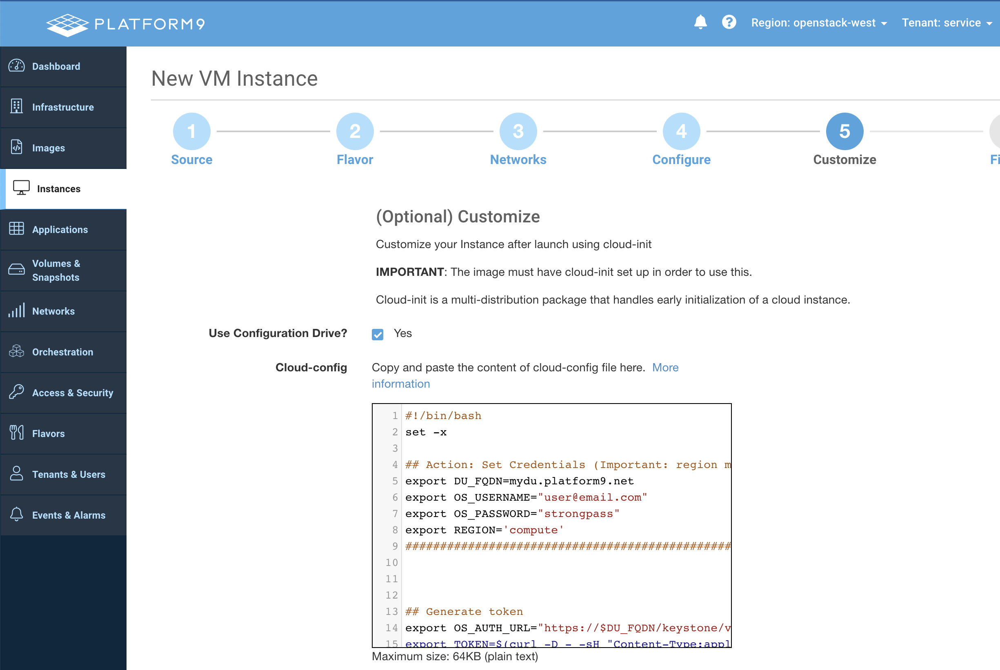
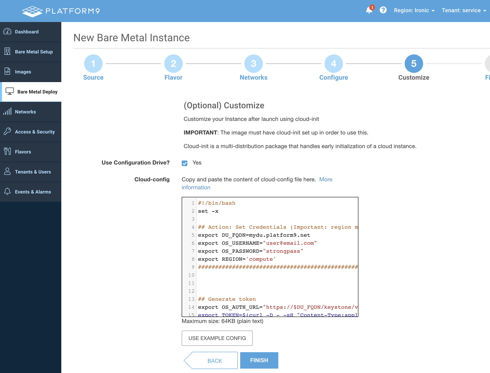

# Deploying a PMO Host with cloud-init

## Steps

#### 1. Update the following options in the script: `DU_FQDN`, `OS_USERNAME`, `OS_PASSWORD`, `REGION`, `DNS_DOMAIN`
* `DU_FQDN`: Management plane URL. Exclude https:// protocol. Example: `acme.platform9.net`
* `OS_USERNAME`: Username of an admin account associated with the management plane
* `OS_PASSWORD`: Admin user password
*  `REGION`: The region name can be found on the top-right corner of the Platform9 UI
* `DNS_DOMAIN`: Specify the DNS domain name for your organization. If the DNS domain is specified, a VM's FQDN will be <vm_name>.<dns_domain_name>. If not specified, the default OpenStack VM FQDN is host-<hyphen_separated_vm_ip_address>.openstacklocal. 
```
#!/bin/bash
set -x

## Action: Set Credentials (Important: region must be in all lowercase)
export DU_FQDN=mydu.platform9.net
export OS_USERNAME="user@email.com"
export OS_PASSWORD="strongpass"
export REGION='compute'
export DNS_DOMAIN='openstacklocal'
###################################################


## Generate token
export OS_AUTH_URL="https://$DU_FQDN/keystone/v3"
export TOKEN=$(curl -D - -sH "Content-Type:application/json" https://$DU_FQDN/keystone/v3/auth/tokens -d '{"auth":{"identity":{"methods":["password"],"password":{"user":{"name":"'$OS_USERNAME'","domain":{"name": "Default"},"password":"'$OS_PASSWORD'"}}},"scope":{"project":{"domain":{"name":"Default"},"name":"'service'"}}}}' | grep -Ei '^X-Subject-Token' | awk '{print $2}' | tr -d '\r')

curl http://169.254.169.254/openstack/latest/user_data > cloudinit.sh
chmod +x /cloudinit.sh
touch START

## Enable password authentication (optional)
sed -i 's/#PermitRootLogin yes/PermitRootLogin yes/' /etc/ssh/sshd_config
sed -i 's/PasswordAuthentication no/PasswordAuthentication yes/' /etc/ssh/sshd_config
service sshd restart
setenforce Permissive


## Install openvswitch
wget -q -O - https://platform9-neutron.s3-us-west-1.amazonaws.com/ubuntu_latest/key.gpg | apt-key add - 
echo "deb http://platform9-neutron.s3-us-west-1.amazonaws.com/ubuntu_latest /" > /etc/apt/sources.list.d/platform9_neutron_s3.list
apt-get update -y
apt-get install openvswitch-switch -y
systemctl enable openvswitch-switch
systemctl start openvswitch-switch

## Get IP address, mac, gw 
export IP=`ip -4 addr show ens3 | grep -Po 'inet \K[0-9.]*'` 
export MAC=`ip -4 link show ens3 | grep -Po 'ether \K[0-9:a-f]*'`
export GW=`ip route | grep default | awk '{print $3}'`

## OVS bridge config (assumes ens3)
ovs-vsctl add-br br-pf9
#ovs-vsctl add-port br-pf9 ens3 && ovs-vsctl set bridge br-pf9 other_config:hwaddr=$MAC
#ip addr add $IP/24 dev br-pf9 && ip addr flush dev ens3 && ip link set up br-pf9 && ip route add default via $GW dev br-pf9

#centos/rhel/rocky:
#mv /etc/sysconfig/network-scripts/ifcfg-ens3 /etc/sysconfig/network-scripts/ifcfg-br-pf9 
#sed -i 's/ens3/br-pf9/' /etc/sysconfig/network-scripts/ifcfg-br-pf9
#echo 'DEFROUTE=yes' >>  /etc/sysconfig/network-scripts/ifcfg-br-pf9


## Download and execute hostagent installer  
curl -sH "X-Auth-Token: $TOKEN" https://$DU_FQDN/private/platform9-install-compute-debian.sh -O -v
chmod +x platform9-install-compute-debian.sh && ./platform9-install-compute-debian.sh --ntpd --no-proxy
sleep 600
wget https://download.cirros-cloud.net/0.5.2/cirros-0.5.2-x86_64-disk.img && chown pf9:pf9group /cirros-0.5.2-x86_64-disk.img
sleep 60 


## Apply Platform9 Roles via CURL 
export HOST_ID=`cat /etc/pf9/host_id.conf | grep host_id | awk '{print $3}'`
#export IP=`ip -4 addr show br-pf9 | grep -Po 'inet \K[0-9.]*'`
#export IP=`ip -4 addr show ens3 | grep -Po 'inet \K[0-9.]*'`

# Advanced Remote Support
curl  -X 'PUT'  -H "X-Auth-Token: $TOKEN"  -H 'Content-Type: application/json;charset=UTF-8'  \
"https://$DU_FQDN/resmgr/v1/hosts/$HOST_ID/roles/pf9-support"

# Pf9-onboarding role
curl  -X 'PUT'  -H "X-Auth-Token: $TOKEN"  -H 'Content-Type: application/json;charset=UTF-8'  \
"https://$DU_FQDN/resmgr/v1/hosts/$HOST_ID/roles/pf9-onboarding"

# Neutron Base 
curl  -X 'PUT'  -H "X-Auth-Token: $TOKEN"  -H 'Content-Type: application/json;charset=UTF-8'  \
"https://$DU_FQDN/resmgr/v1/hosts/$HOST_ID/roles/pf9-neutron-base"

# Nova
curl  -X 'PUT'  -H "X-Auth-Token: $TOKEN"  -H 'Content-Type: application/json;charset=UTF-8'  \
"https://$DU_FQDN/resmgr/v1/hosts/$HOST_ID/roles/pf9-ostackhost-neutron" \
 -d "{\"novncproxy_base_url\":\"http://$IP:6080/vnc_auto.html\"}"

# Glance
curl  -X 'PUT'  -H "X-Auth-Token: $TOKEN"  -H 'Content-Type: application/json;charset=UTF-8'  \
"https://$DU_FQDN/resmgr/v1/hosts/$HOST_ID/roles/pf9-glance-role" \
-d "{\"endpoint_address\": \"$IP\", \"update_public_glance_endpoint\": \"false\"}"

# Neutron OVS Agent Config
# May need to change external:br-pf9 bridge mapping 
curl  -X 'PUT'  -H "X-Auth-Token: $TOKEN"  -H 'Content-Type: application/json;charset=UTF-8'  \
"https://$DU_FQDN/resmgr/v1/hosts/$HOST_ID/roles/pf9-neutron-ovs-agent" \
-d "{\"bridge_mappings\": \"external:br-pf9\", \"enable_tunneling\": \"True\", \"tunnel_types\": \"vxlan\", \"local_ip\": \"$IP\", \"net_type\": \"vlan,vxlan\", \"enable_distributed_routing\": \"True\"}"

# Neutron L3 agent Config
curl  -X 'PUT'  -H "X-Auth-Token: $TOKEN"  -H 'Content-Type: application/json;charset=UTF-8'  \
"https://$DU_FQDN/resmgr/v1/hosts/$HOST_ID/roles/pf9-neutron-l3-agent" \
-d '{"agent_mode": "dvr_snat"}'

# Neutron DHCP Config
curl  -X 'PUT'  -H "X-Auth-Token: $TOKEN"  -H 'Content-Type: application/json;charset=UTF-8'  \
"https://$DU_FQDN/resmgr/v1/hosts/$HOST_ID/roles/pf9-neutron-dhcp-agent" \
-d "{\"dnsmasq_dns_servers\": \"8.8.8.8\", \"dns_domain\": \"$DNS_DOMAIN\"}"


# Neutron Metadata Agent Config
curl  -X 'PUT'  -H "X-Auth-Token: $TOKEN"  -H 'Content-Type: application/json;charset=UTF-8'  \
"https://$DU_FQDN/resmgr/v1/hosts/$HOST_ID/roles/pf9-neutron-metadata-agent"
```

#### 2. Deploy a Virtual Machine or Bare Metal Instance and specify the cloud-init script during boot time. 
Important: Ensure Config Drive is Enabled

###### Example - PMO Virtual Machine Creation Wizard:


###### Example - Ironic Bare Metal Server Creation Wizard:

